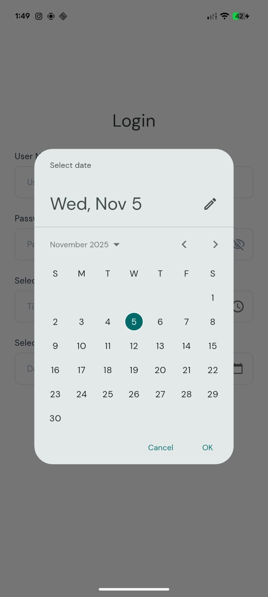
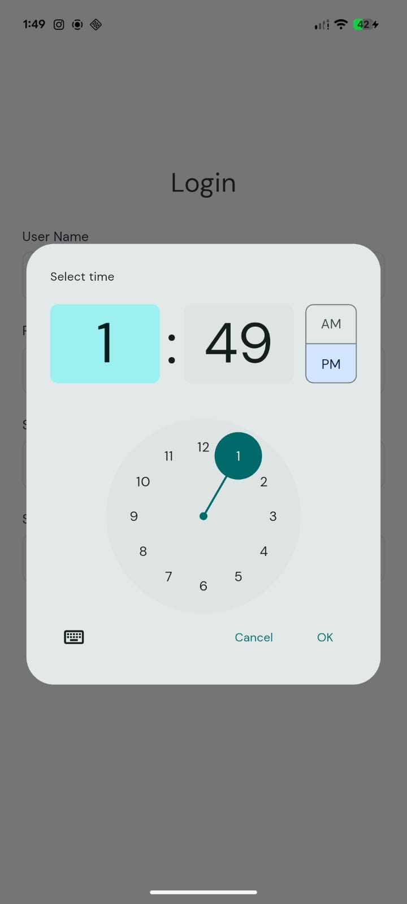

# ✨ advanced_textfield

A **highly customizable Flutter `TextFormField` widget** with built-in support for password visibility toggle, date and time pickers, and SVG icons.  
Designed to save time and maintain consistency across your app forms.

---

## 📸 Screenshots

### Basic Text Field


### Date Field with Toggle


### Time Picker Example


### Gif  Example


---

## 🚀 Features

- 📝 Standard text input with full validation support  
- 🔒 Password field with visibility toggle  
- 📅 Built-in Date Picker  
- ⏰ Built-in Time Picker  
- 🖼️ Supports prefix and suffix **SVG icons**  
- 🎨 Configurable border radius, fill color, height, and spread shadow  
- ⌨️ Supports custom keyboard types and formatters  
- 🧩 Easy to integrate in any project  
- 🌐 Compatible with Android, iOS, and Web  

---

## 📦 Installation

Add the package to your project:

```yaml
dependencies:
  advanced_textfield: ^1.0.0
